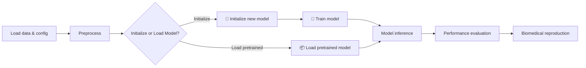

# Awesome Spatial Graphomics
[](https://awesome.re)


> [!IMPORTANT]
> This repository is in **early development** 🚧 — currently focused on paper collection, task categorization, and reproducibility setup. Benchmark notebooks and leaderboards are coming soon!

A curated, structured, and reproducible hub for **graph learning in spatial transcriptomics and related omics modalities**.
Built on [`omics-base`](https://github.com/zs144/omics-base-env) — designed to accelerate reproducibility and benchmarking across spatial omics studies.


## 🌎 Overview

**Awesome Spatial Graphomics** aims to organize, benchmark, and interpret the growing body of research applying **Graph Neural Networks (GNNs)** and related graph learning methods to spatially resolved omics data.


## 🎯 Key Goals

* 📚 Curate key papers and categorize them by **biological task** and **model architectures**.
* 🧠 Highlight **biomedical insights**, along with quantitative performance metrics.
* 🧪 Provide **reproducible benchmark scripts** built with `omics-base`.
* 🔍 Discuss **limitations and future directions** to guide new ideas.

This repository will evolve as a **living reference** for the spatial omics and graph learning communities.


## 📂 Repository Structure

```
awesome-spatial-graphomics/
│
├── literature/     # Paper summaries by biological task
├── repos/          # Code repos of the selected methods
├── datasets/       # Datasets (including metadata)
├── benchmark/      # Reproducible benchmarking pipeline
├── notebooks/      # Example notebooks for visualization and analysis
└── figures/        # Model architecture and training workflow
```


## 🧠 Classification Schema

**Primary organization:** by **biological task**

* Spatial domain detection / clustering
* Cell–cell interaction or niche identification
* Gene regulatory network inference
* Cell type or state annotation
* Spatial gene expression imputation / denoising

Each task section may include architecture tags such as `GCN-like`, `GAT`, `GVAE`, `Graph Transformer`, or `Custom`.


## 🕰️ Benchmarking Pipeline

* Implement representative models for each task category.
* Use standardized preprocessing pipelines via `omics-base`.
* Evaluate on open spatial omics datasets with relevant metrics.
* Summarize both **quantitative performance** and **biological insights**.




## ⚖️ License

MIT License – see [LICENSE](./LICENSE) for details.


## 🔖 Citation

If you use or reference this repository, please cite:

```
Sheng Z. (2025). Awesome Spatial Graphomics: A Curated and Benchmarking Hub for Graph Learning in Spatial Omics. github.com/zs144/awesome-spatial-graphomics
```


### ✨ Maintained by

**Zion Sheng** — computational biology researcher passionate about reproducibility, graph learning, and open science.
